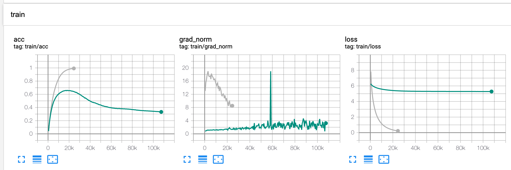

# ECAPA-TDNN
Unofficial implementation of ECAPA-TDNN

# Remarks

Training a ECAPA-TDNN model took 3 days.

### Effect of Feature Re-scaling

The classification loss is bounded by the rescaling factor s, and the number of classes.

When the loss bound is too large, a model fails to discriminate speakers. 

Green - s = 1

Gray - s = 16

### Attention Matrix Alpha

1. Channel independent attention values (Alpha Matrix) are mostly similar along channel axis, indicating channel independent attention is unnecessary.
2. Mean attention score (Mean Alpha) tends to be high when the voice is present, indicating the model is "listening" to what is being spoken. The attention score seems pretty similar to VAD(voice activity detection) score.
3. Attention score is not correlated to the volume of the speech. The model sometimes focuses on how the speaker ends the speech (the maximum value on the graph). It would be interesting to investigate which portion of the speech characterizes a distinctive speaker.

### Speaker Embedding

Cosine similarity of speaker embedding is being close to zero during the training proces, meaning AAM (Additive Angular Margin) Loss is successful in diagonalizing the speaker identity.

### Inference Similarity

Inference result seems to be discriminitive, but there was a mistake. An identity vector of a speaker is calculated as a mean of the vectors from all speechs of that speaker. As seens from below histogram, even for completely random vectors h(x) and h(y), cosine similarity between h(x) and mu(x) becomes biased.

### Cosine Simarity and Dimension

As dimension h increases, distribution of cosine similarity between two random vector becomes a normal distribution lower standard deviation. In other words, two random vectors are more likely to be diagonal as dimension increases.

# References

1. [ECAPA-TDNN: Emphasized Channel Attention, Propagation and Aggregation in TDNN Based Speaker Verification](https://arxiv.org/abs/2005.07143)
2. [ArcFace: Additive Angular Margin Loss for Deep Face Recognition](https://arxiv.org/abs/1801.07698)
3. [VoxCeleb](https://www.robots.ox.ac.uk/~vgg/data/voxceleb/)

# TODO

- [x] Get VoxCeleb statistics (file length and counts, sampling rate)

- [x] Build speaker tokenizer

- [ ] Apply VAD to segment audio files

- [x] Run model on VoxCeleb1

- [ ] Implement .m4a loading

- [ ] Run model on VoxCeleb2

  

  

